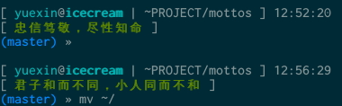

# Introduction

A small bash script uses `fortune` to random select a motto from mottos you collected. It's very easy to integrate this script into the shell prompt or tmux/vim status bar. It should make the prompt more pretty. See [Screenshot](#screenshot) below.

# Config Your Mottos

Save your mottos in file `mottos`. You can change this location by modifying `MOTTOS_DIR` and `MOTTOS_SOURCE` in `mottos.sh`.

By defaults, `MOTTOS_DIR` is set to `~/.mottos`. `MOTTOS_SOURCE` is set to `${MOTTOS_DIR}/mottos`.

# Random Select

After your mottos configured, run `mottos.sh` to get a motto.

# Screenshot

shell prompt

